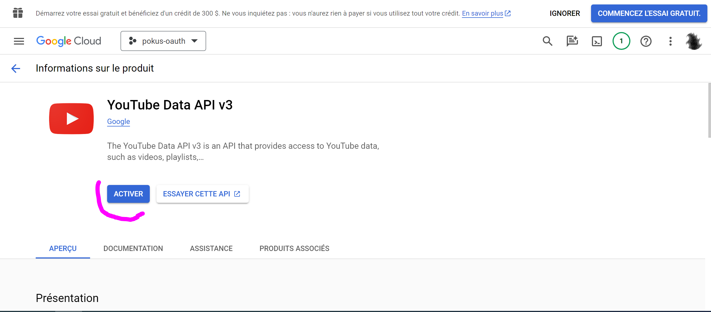
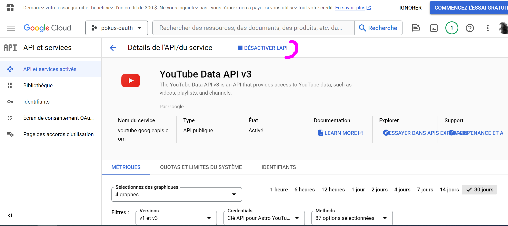

# Juste (un) Curieux

Bienvenue!

## How the project was spawned

```bash

npm create astro@latest -- --template mhyfritz/astro-landing-page

pnpm dlx create astro@latest -- --template mhyfritz/astro-landing-page
```

## Tailwind animated

* https://github.com/new-data-services/tailwindcss-animated#readme

## YouTube Data API

### Search Ongoing Lives

```bash
export YOUTUBE_API_KEY="your google apis API KEY"
export YOUTUBE_CHANNEL_ID="UCGymsagsg1lUxDb2qxjK6Lg"
export DEFAULT_YOUTUBE_PLAYLIST_ID="B96JKl2IEv0"

# ---
# search ongoing lives:
curl -X GET "https://www.googleapis.com/youtube/v3/search?part=snippet&channelId=${YOUTUBE_CHANNEL_ID}&type=video&eventType=live&key=${YOUTUBE_API_KEY}" | jq .

# ---
# search upcoming lives:
curl -X GET "https://www.googleapis.com/youtube/v3/search?part=liveStreamingDetails&channelId=${YOUTUBE_CHANNEL_ID}&type=video&eventType=upcoming&key=${YOUTUBE_API_KEY}" | jq .

export UPCOMING_LIVE_VIDEOID=$(curl -X GET "https://www.googleapis.com/youtube/v3/search?part=snippet&channelId=${YOUTUBE_CHANNEL_ID}&type=video&eventType=upcoming&key=${YOUTUBE_API_KEY}" | jq .items[0].id.videoId | awk -F '"' '{ print $2 }')

echo " UPCOMING_LIVE_VIDEOID = [${UPCOMING_LIVE_VIDEOID}]"


curl -X GET "https://www.googleapis.com/youtube/v3/videos?part=liveStreamingDetails&part=status&part=snippet&id=${UPCOMING_LIVE_VIDEOID}&&channelId=${YOUTUBE_CHANNEL_ID}&type=video&eventType=upcoming&key=${YOUTUBE_API_KEY}" | jq .

# videos?part=snippet,liveStreamingDetails,status
curl \
  'https://youtube.googleapis.com/youtube/v3/videos?part=liveStreamingDetails&key=[YOUR_API_KEY]' \
  --header 'Accept: application/json' \
  --compressed
```

After creating the API Key to hit the googleapis, and use YouTube Data API, then you will have an explicit 403 error mesage explaining you need to acivate the Youtube Data API before being allowed to use it:

```bash
$ curl -X GET "https://www.googleapis.com/youtube/v3/search?part=snippet&channelId=${YOUTUBE_CHANNEL_ID}&type=video&eventType=live&key=${YOUTUBE_API_KEY}" | jq .
  % Total    % Received % Xferd  Average Speed   Time    Time     Time  Current
                                 Dload  Upload   Total   Spent    Left  Speed
100  1571    0  1571    0     0    979      0 --:--:--  0:00:01 --:--:--   978
{
  "error": {
    "code": 403,
    "message": "YouTube Data API v3 has not been used in project 1080266325902 before or it is disabled. Enable it by visiting https://console.developers.google.com/apis/api/youtube.googleapis.com/overview?project=1080266325902 then retry. If you enabled this API recently, wait a few minutes for the action to propagate to our systems and retry.",
    "errors": [
      {
        "message": "YouTube Data API v3 has not been used in project 1080266325902 before or it is disabled. Enable it by visiting https://console.developers.google.com/apis/api/youtube.googleapis.com/overview?project=1080266325902 then retry. If you enabled this API recently, wait a few minutes for the action to propagate to our systems and retry.",
        "domain": "usageLimits",
        "reason": "accessNotConfigured",
        "extendedHelp": "https://console.developers.google.com"
      }
    ],
    "status": "PERMISSION_DENIED",
    "details": [
      {
        "@type": "type.googleapis.com/google.rpc.Help",
        "links": [
          {
            "description": "Google developers console API activation",
            "url": "https://console.developers.google.com/apis/api/youtube.googleapis.com/overview?project=1080266325902"
          }
        ]
      },
      {
        "@type": "type.googleapis.com/google.rpc.ErrorInfo",
        "reason": "SERVICE_DISABLED",
        "domain": "googleapis.com",
        "metadata": {
          "service": "youtube.googleapis.com",
          "consumer": "projects/1080266325902"
        }
      }
    ]
  }
}

```

And after activating it, here is the results you're goona have:

* zero items in results when no live is ongoing:

```bash
Utilisateur@Utilisateur-PC MINGW64 ~
$ curl -X GET "https://www.googleapis.com/youtube/v3/search?part=snippet&channelId=${YOUTUBE_CHANNEL_ID}&type=video&eventType=live&key=${YOUTUBE_API_KEY}" | jq .
  % Total    % Received % Xferd  Average Speed   Time    Time     Time  Current
                                 Dload  Upload   Total   Spent    Left  Speed
100   189    0   189    0     0    194      0 --:--:-- --:--:-- --:--:--   194
{
  "kind": "youtube#searchListResponse",
  "etag": "VHzDuFtzzzFSHtie6VKNX_MT6tQ",
  "regionCode": "FR",
  "pageInfo": {
    "totalResults": 0,
    "resultsPerPage": 0
  },
  "items": []
}

```

* And the result when the live is indeed ongoing:

```bash

```

[](https://console.cloud.google.com/apis/library/youtube.googleapis.com)

[](https://console.cloud.google.com/apis/library/youtube.googleapis.com)

### Search Upcoming Livestreams

```bash
export YOUTUBE_API_KEY="your google apis API KEY"
export YOUTUBE_CHANNEL_ID="UCGymsagsg1lUxDb2qxjK6Lg"
export DEFAULT_YOUTUBE_PLAYLIST_ID="B96JKl2IEv0"

# ---
# search upcoming lives:
curl -X GET "https://www.googleapis.com/youtube/v3/search?part=liveStreamingDetails&channelId=${YOUTUBE_CHANNEL_ID}&type=video&eventType=upcoming&key=${YOUTUBE_API_KEY}" | jq .

export UPCOMING_LIVE_VIDEOID=$(curl -X GET "https://www.googleapis.com/youtube/v3/search?part=snippet&channelId=${YOUTUBE_CHANNEL_ID}&type=video&eventType=upcoming&key=${YOUTUBE_API_KEY}" | jq .items[0].id.videoId | awk -F '"' '{ print $2 }')

echo " UPCOMING_LIVE_VIDEOID = [${UPCOMING_LIVE_VIDEOID}]"


curl -X GET "https://www.googleapis.com/youtube/v3/videos?part=liveStreamingDetails&part=status&part=snippet&id=${UPCOMING_LIVE_VIDEOID}&&channelId=${YOUTUBE_CHANNEL_ID}&type=video&eventType=upcoming&key=${YOUTUBE_API_KEY}" | jq .

# videos?part=snippet,liveStreamingDetails,status
curl \
  'https://youtube.googleapis.com/youtube/v3/videos?part=liveStreamingDetails&key=[YOUR_API_KEY]' \
  --header 'Accept: application/json' \
  --compressed
```

And an example answers for an upcoming live stream (2 reuests, the first to get the video ID, and the second to get more details, which answers give the below JSON responses):

* First request, to get the videoID, gives the below JSON response:

```bash
$ curl -X GET "https://www.googleapis.com/youtube/v3/search?part=snippet&channelId=${YOUTUBE_CHANNEL_ID}&type=video&eventType=upcoming&key=${YOUTUBE_API_KEY}" | jq .
  % Total    % Received % Xferd  Average Speed   Time    Time     Time  Current
                                 Dload  Upload   Total   Spent    Left  Speed
100  1363    0  1363    0     0   2331      0 --:--:-- --:--:-- --:--:--  2333
{
  "kind": "youtube#searchListResponse",
  "etag": "pLyjEEuIgR45Y3Acfq9NGxj3CLk",
  "regionCode": "FR",
  "pageInfo": {
    "totalResults": 1,
    "resultsPerPage": 1
  },
  "items": [
    {
      "kind": "youtube#searchResult",
      "etag": "XBsLBSt_XKrYt1s0bNNKNdWip-4",
      "id": {
        "kind": "youtube#video",
        "videoId": "-bS3fde8tp0"
      },
      "snippet": {
        "publishedAt": "2024-02-05T16:58:04Z",
        "channelId": "UCGymsagsg1lUxDb2qxjK6Lg",
        "title": "test de fonctionnalités",
        "description": "Je vais planifier un live sur youtube, afin de vérifier que mon composant preact récupère bien le flux de live lorsqu'il commence.",
        "thumbnails": {
          "default": {
            "url": "https://i.ytimg.com/vi/-bS3fde8tp0/default_live.jpg",
            "width": 120,
            "height": 90
          },
          "medium": {
            "url": "https://i.ytimg.com/vi/-bS3fde8tp0/mqdefault_live.jpg",
            "width": 320,
            "height": 180
          },
          "high": {
            "url": "https://i.ytimg.com/vi/-bS3fde8tp0/hqdefault_live.jpg",
            "width": 480,
            "height": 360
          }
        },
        "channelTitle": "Jean-Baptiste Lasselle",
        "liveBroadcastContent": "upcoming",
        "publishTime": "2024-02-05T16:58:04Z"
      }
    }
  ]
}

```
* The second request, gives the below video information details, including the scheduled start date/time : 

```bash
$ curl -X GET "https://www.googleapis.com/youtube/v3/videos?part=liveStreamingDetails&part=status&part=snippet&id=${UPCOMING_LIVE_VIDEOID}&&channelId=${YOUTUBE_CHANNEL_ID}&type=video&eventType=upcoming&key=${YOUTUBE_API_KEY}" | jq .
  % Total    % Received % Xferd  Average Speed   Time    Time     Time  Current
                                 Dload  Upload   Total   Spent    Left  Speed
100  2247    0  2247    0     0   8925      0 --:--:-- --:--:-- --:--:--  8952
{
  "kind": "youtube#videoListResponse",
  "etag": "9jm6rg34LaONhxqE7rtBzRtnTbE",
  "items": [
    {
      "kind": "youtube#video",
      "etag": "GG6r2sAPFd074jXI9qn51wTCV1o",
      "id": "-bS3fde8tp0",
      "snippet": {
        "publishedAt": "2024-02-05T16:58:04Z",
        "channelId": "UCGymsagsg1lUxDb2qxjK6Lg",
        "title": "test de fonctionnalités",
        "description": "Je vais planifier un live sur youtube, afin de vérifier que mon composant preact récupère bien le flux de live lorsqu'il commence",
        "thumbnails": {
          "default": {
            "url": "https://i.ytimg.com/vi/-bS3fde8tp0/default_live.jpg",
            "width": 120,
            "height": 90
          },
          "medium": {
            "url": "https://i.ytimg.com/vi/-bS3fde8tp0/mqdefault_live.jpg",
            "width": 320,
            "height": 180
          },
          "high": {
            "url": "https://i.ytimg.com/vi/-bS3fde8tp0/hqdefault_live.jpg",
            "width": 480,
            "height": 360
          },
          "standard": {
            "url": "https://i.ytimg.com/vi/-bS3fde8tp0/sddefault_live.jpg",
            "width": 640,
            "height": 480
          },
          "maxres": {
            "url": "https://i.ytimg.com/vi/-bS3fde8tp0/maxresdefault_live.jpg",
            "width": 1280,
            "height": 720
          }
        },
        "channelTitle": "Jean-Baptiste Lasselle",
        "categoryId": "22",
        "liveBroadcastContent": "upcoming",
        "localized": {
          "title": "test de fonctionnalités",
          "description": "Je vais planifier un live sur youtube, afin de vérifier que mon composant preact récupère bien le flux de live lorsqu'il commence"
        }
      },
      "status": {
        "uploadStatus": "uploaded",
        "privacyStatus": "public",
        "license": "youtube",
        "embeddable": true,
        "publicStatsViewable": true,
        "madeForKids": true
      },
      "liveStreamingDetails": {
        "scheduledStartTime": "2024-02-05T19:00:00Z",
        "activeLiveChatId": "Cg0KCy1iUzNmZGU4dHAwKicKGFVDR3ltc2Fnc2cxbFV4RGIycXhqSzZMZxILLWJTM2ZkZTh0cDA"
      }
    }
  ],
  "pageInfo": {
    "totalResults": 1,
    "resultsPerPage": 1
  }
}

```


For that same upcoming livestream, we have the following embed iframe given by youtube:

```Html

<iframe width="560" height="315" src="https://www.youtube.com/embed/-bS3fde8tp0?si=NNMyDFPJcEorrEHG" title="YouTube video player" frameborder="0" allow="accelerometer; autoplay; clipboard-write; encrypted-media; gyroscope; picture-in-picture; web-share" allowfullscreen>

</iframe>
```

So with axios, we will :
* get the video id from the **first request** response like this:
  * `response.data.items[0].id.videoId`
* get all other informations about the video, from the **second request**, like this:
  * `response.data.items[0].snippet.title`
  * `response.data.items[0].snippet.description`
  * Thumbnails :
    * smallest:
      * `response.data.snippet.thumbnails.default.url`
      * `response.data.snippet.thumbnails.default.width`
      * `response.data.snippet.thumbnails.default.height`
    * medium:
      * `response.data.snippet.thumbnails.medium.url`
      * `response.data.snippet.thumbnails.medium.width`
      * `response.data.snippet.thumbnails.medium.height`
    * medium:
      * `response.data.snippet.thumbnails.medium.url`
      * `response.data.snippet.thumbnails.medium.width`
      * `response.data.snippet.thumbnails.medium.height`
  * Livestream start date and active live chat id:
    * start date/time: `response.data.items[0].liveStreamingDetails.scheduledStartTime`
    * active live chat id : `response.data.items[0].liveStreamingDetails.activeLiveChatId`
